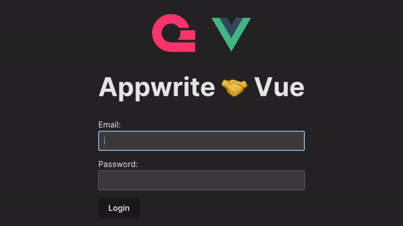

# Appwrite + Vue Starter

This template helps you get setup quickly with Appwrite + Vue JS. Template includes the following:

-   Page routing with `vue-router`.
-   User login
-   Protected pages with Navigation Gaurds
-   State management with `Pinia`
-   Logout functionality

### Prerequisites

-   Create an account and project with <a href="https://appwrite.io/" target="_blank">appwrite.io</a>
-   Create a user (remember the users email and password)
-   Initialize web SDK and configure CORS: Overview > Getting started > Add a platform > Web. For hostname add `localhost`.

### Getting Started

-   Clone repo: `git clone` && `cd vue-appwrite-starter`
-   Create a `.env` file using `.env.example` and add your Appwrite Project ID
